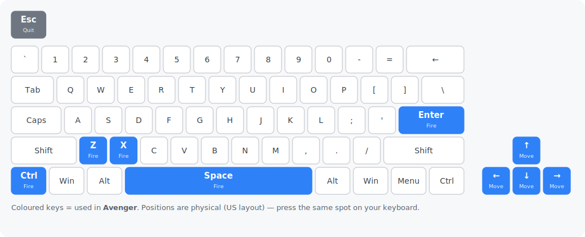

# Avenger — Go port

[](https://github.com/chrplr/avenger-go/releases/latest)

**▶ Play it in your browser: <https://chrplr.github.io/avenger-go/>**

A Go re-implementation of the Pygame Zero game **Avenger** from *Code the Classics
Volume 2* (Raspberry Pi Press), built on
[go-sdl3](https://github.com/Zyko0/go-sdl3) and the
[pgzgo](https://github.com/chrplr/pgzgo) harness.

All images, sounds and music are embedded, so `go build` produces a single
self-contained binary that needs no asset files at run time.

## Controls

Single-player shooter.

| Action | Keyboard | Gamepad |
|--------|----------|---------|
| Move   | Arrow keys | D-pad or left stick |
| Fire   | Space, Enter, Z, X, or Ctrl | A or B |
| Start  | any Fire key | A or B |
| Quit   | Esc | Start |

Gamepad support is native-only; the in-browser build is keyboard-only.

**Playing on a non-US keyboard?** The game reads *physical key positions* (US QWERTY layout), not the printed letters — so on an AZERTY or QWERTZ keyboard a labelled key may sit somewhere else. Find each key on the picture below and press the same spot on your own board.



## How to play

**The goal.** It's a Defender-style shooter. You fly back and forth across a long, wrapping landscape defending the **humans** on the ground from waves of aliens. Destroy every enemy in a wave to move on to the next, bigger one.

**Protect the humans.** Alien **landers** drop down and try to grab a human and carry it up to the top of the screen. Shoot the lander before it gets there. If a human is successfully abducted it turns into a fast, dangerous **mutant** — so stop the abductions early.

**Rescue drops.** Shoot a lander that's already carrying a human and the human falls. Fly underneath to **catch it**, then carry it back down and set it safely on the ground.

**Flying and shooting.** **Move** in all directions and hold **Fire** to shoot ahead of you; the level is much wider than the screen, so chase enemies across it and use the scroll to cover both ends. You start with **5 lives** and a **shield** that soaks up some hits before you lose one. Press a Fire key to start.

## Download

Prebuilt, self-contained binaries — no install, no dependencies, assets embedded.
Grab the latest for your platform:

- **Linux** (amd64) — [avenger-linux-amd64.tar.gz](https://github.com/chrplr/avenger-go/releases/latest/download/avenger-linux-amd64.tar.gz)
- **macOS** (Apple Silicon) — [avenger-macos-arm64.tar.gz](https://github.com/chrplr/avenger-go/releases/latest/download/avenger-macos-arm64.tar.gz)
- **Windows** (amd64) — [avenger-windows-amd64.zip](https://github.com/chrplr/avenger-go/releases/latest/download/avenger-windows-amd64.zip)

All versions are on the [releases page](https://github.com/chrplr/avenger-go/releases).

## Run

```sh
go run .
```

go-sdl3 bundles the SDL3, SDL3_image and SDL3_mixer libraries and extracts them at
startup, so no system SDL install is needed.

## Provenance & license

Ported to Go from the Python original in *Code the Classics Volume 2*. The game
design and original assets are © their respective authors / Raspberry Pi Press.

The original Python code and assets are in Raspberry Pi Press's [Code the Classics — Volume 2](https://github.com/raspberrypipress/Code-the-Classics-Vol2) repository.

The Go source code of this port is distributed under the MIT License.

See `Python_and_Go_implementation_comparison.md` for a walkthrough of how the port
maps onto the original.
